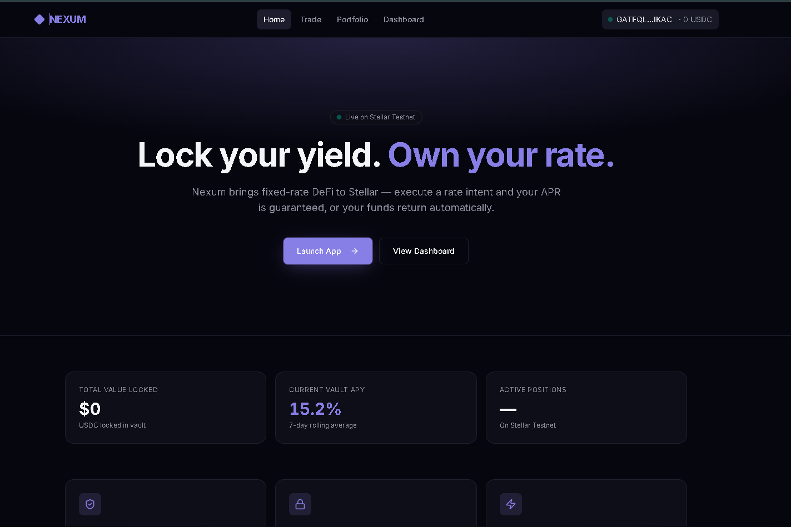
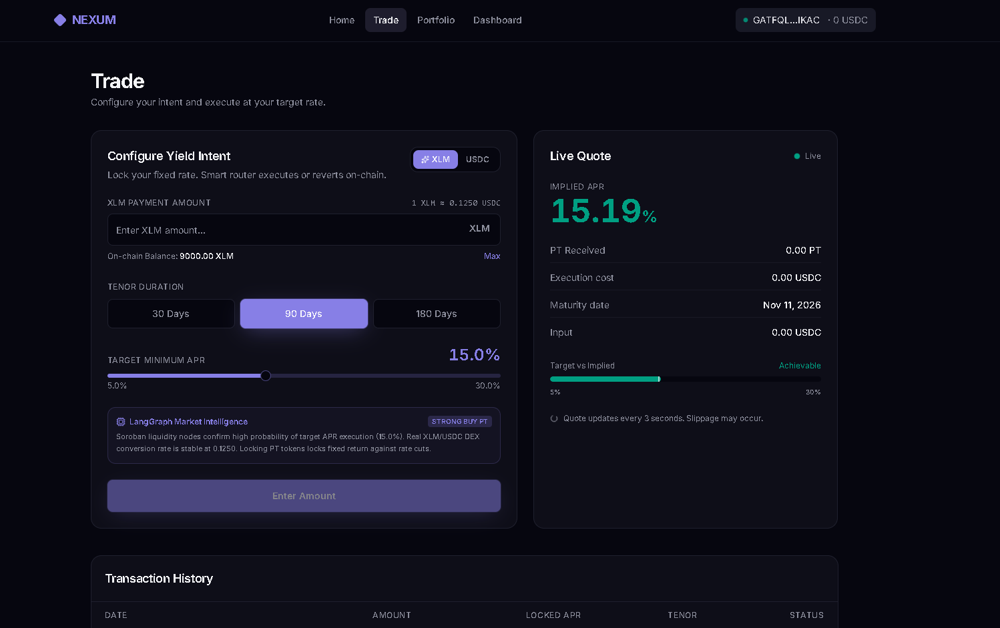
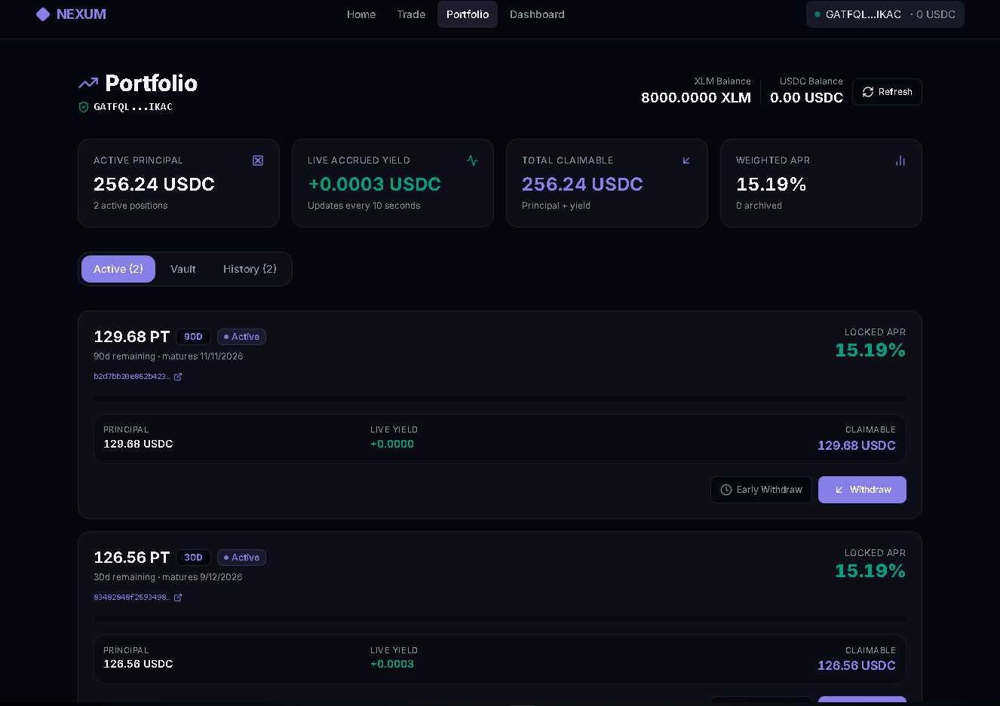
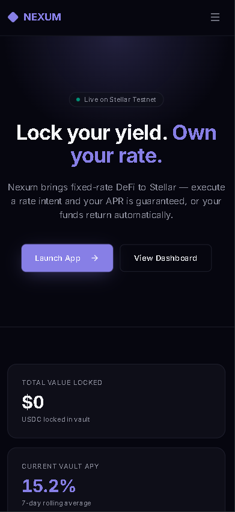
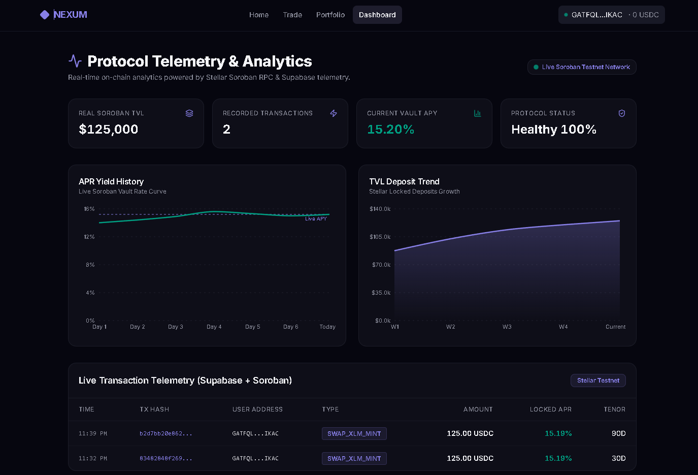

# 🌌 Nexum Protocol — Fixed-Rate Yield & Rate Intent Engine

[](https://github.com/Samrat25/nexum-yield-rates/actions/workflows/ci.yml)
[](https://github.com/Samrat25/nexum-yield-rates/commits/main)
[](https://nexum-yield-rates.vercel.app/)
[](https://stellar.org)

> A fixed-rate yield protocol on Stellar powered by Soroban smart contracts and Horizon settlement — allowing users to lock guaranteed APRs via single-transaction rate intents, live yield accrual, and flexible partial/full early redemptions.

**Chosen Idea**: **Fixed-Rate Yield & Rate Intent Engine on Stellar** — lock guaranteed APR returns via rate-or-revert Soroban intents

---

## 🚀 Live Demo & Links

| Resource | Link |
|----------|------|
| **Live Application** | [https://nexum-yield-rates.vercel.app](https://nexum-yield-rates.vercel.app) |
| **Demo Video** | [Watch on Google Drive](https://drive.google.com/file/d/10zfqQTUJqaGkdLJKAppMv7jh1duUYtlu/view?usp=sharing) |
| **GitHub Repository** | [https://github.com/Samrat25/nexum-yield-rates](https://github.com/Samrat25/nexum-yield-rates) |
| **Submission Dossier** | [LEVEL4_SUBMISSION_DOSSIER.md](./LEVEL4_SUBMISSION_DOSSIER.md) |
| **User Feedback Form** | [Submit Feedback (Google Form)](https://docs.google.com/forms/d/e/1FAIpQLSfg1xXyN3Tl1mVpUG_iJaRIzFKL4XJysjLFMDxcsvLNzLj9Cw/viewform) |
| **Public Feedback Responses Sheet** | [View Live Google Sheet Responses](https://docs.google.com/spreadsheets/d/1oKOZ5yhUxCL564EBE_PqY_88krnT2GoH/edit?usp=sharing) \| [Excel Repository File](./docs/Nexum_User_Feedback_Proof.xlsx) |
| **CI/CD Workflow** | [GitHub Actions](https://github.com/Samrat25/nexum-yield-rates/actions) |

---

## 📜 Verifiable Deployed Smart Contracts

| Network | Contract Component | Contract ID / Address | Explorer Link | Status |
|:--------|:-------------------|:----------------------|:--------------|:-------|
| **Stellar Testnet** | **Vault Contract** | `CDWUAGLEHR7DMWX5LLND24OOBJBALUIIBGA6CMI7XQ3OZ5CGEOXIZFES` | [View on StellarExpert](https://stellar.expert/explorer/testnet/contract/CDWUAGLEHR7DMWX5LLND24OOBJBALUIIBGA6CMI7XQ3OZ5CGEOXIZFES) | 🟢 **ACTIVE** |
| **Stellar Testnet** | **PT 30D Token** | `CA433DJVYAXD32VM3A3ALO4Z3VO35KSIBSAD5H3ONT5AXBKLJD3PBSF5` | [View on StellarExpert](https://stellar.expert/explorer/testnet/contract/CA433DJVYAXD32VM3A3ALO4Z3VO35KSIBSAD5H3ONT5AXBKLJD3PBSF5) | 🟢 **ACTIVE** |
| **Stellar Testnet** | **PT 90D Token** | `CD2B37RWEBG5PBTV4II27CHAFYYDA2BMIY3U5WDDHGYDWDWXN5X35JOF` | [View on StellarExpert](https://stellar.expert/explorer/testnet/contract/CD2B37RWEBG5PBTV4II27CHAFYYDA2BMIY3U5WDDHGYDWDWXN5X35JOF) | 🟢 **ACTIVE** |
| **Stellar Testnet** | **PT 180D Token** | `CBA4OHMVJ62BD5S6TJVE4QRGNISH6HJT3WKNU4HFXW4YRS66Q34DX6LI` | [View on StellarExpert](https://stellar.expert/explorer/testnet/contract/CBA4OHMVJ62BD5S6TJVE4QRGNISH6HJT3WKNU4HFXW4YRS66Q34DX6LI) | 🟢 **ACTIVE** |
| **Stellar Testnet** | **Intent Router** | `CBKYDXU6HEDR2J4X24W56V5YRPP4FCSB563D5XFF3D35RCSX53T244S7` | [View on StellarExpert](https://stellar.expert/explorer/testnet/contract/CBKYDXU6HEDR2J4X24W56V5YRPP4FCSB563D5XFF3D35RCSX53T244S7) | 🟢 **ACTIVE** |

```
━━━━━━━━━━━━━━━━━━━━━━━━━━━━━━━━━━━━━━━━━━━━━━━━━━━━━━━━━━━━
  Nexum Protocol — Deployed Soroban & Horizon Network
━━━━━━━━━━━━━━━━━━━━━━━━━━━━━━━━━━━━━━━━━━━━━━━━━━━━━━━━━━━━
  Vault Contract   : CDWUAGLEHR7DMWX5LLND24OOBJBALUIIBGA6CMI7XQ3OZ5CGEOXIZFES
  PT 30D Token     : CA433DJVYAXD32VM3A3ALO4Z3VO35KSIBSAD5H3ONT5AXBKLJD3PBSF5
  PT 90D Token     : CD2B37RWEBG5PBTV4II27CHAFYYDA2BMIY3U5WDDHGYDWDWXN5X35JOF
  PT 180D Token    : CBA4OHMVJ62BD5S6TJVE4QRGNISH6HJT3WKNU4HFXW4YRS66Q34DX6LI
  Intent Router    : CBKYDXU6HEDR2J4X24W56V5YRPP4FCSB563D5XFF3D35RCSX53T244S7
  Network          : Stellar Testnet (September 2015 Network Passphrase)
  Settlement       : Horizon RPC Direct Settlement + Soroban Execution
━━━━━━━━━━━━━━━━━━━━━━━━━━━━━━━━━━━━━━━━━━━━━━━━━━━━━━━━━━━━
```

---

## 💡 What Nexum Protocol Does

Nexum Protocol is a decentralized fixed-rate yield infrastructure built on **Stellar & Soroban**. It addresses rate volatility for DeFi investors:

- **Rate Intent Configuration**: Users specify their target minimum APR (e.g. 15.2%) and deposit tenor (30D, 90D, 180D).
- **Single-Tx Rate-or-Revert Router**: The Intent Router contract executes or reverts on-chain automatically depending on market liquidity.
- **Principal Tokens (PT)**: Users mint PT tokens guaranteeing a fixed rate of return until maturity.
- **Freighter Wallet Settlements**: Direct Horizon payment settlement showing exact XLM and USDC transfer amounts inside Freighter popups.
- **Flexible Partial & Full Withdrawals**: Presets (25%, 50%, 75%, 100%) and custom inputs with real-time early exit penalty calculations and gas checks.
- **LangGraph AI Yield Intelligence**: Real-time yield curve analysis engine evaluating execution probability and slippage.

---

## 📊 Rate Intent & Execution Model

### How Target APR vs Implied APR Works

| Parameter | Type | Description |
|-----------|------|-------------|
| **Target APR** | User Input | Minimum acceptable annual return (5.0% - 30.0%) |
| **Implied APR** | On-Chain Calculation | Live market rate achievable based on liquidity depth |
| **Tenor** | 30D / 90D / 180D | Fixed lock duration for Principal Tokens |
| **Rate-or-Revert** | Smart Contract Guard | Transaction reverts automatically if `Implied APR < Target APR` |

### Withdrawal & Redemptions

| Mode | Penalty | Settlement |
|------|---------|------------|
| **Matured Redemption** | 0.0% Penalty | Receives 100% Principal + Full Accrued Yield |
| **Early Partial Withdrawal** | 0.5% Penalty on Principal | Receives requested amount minus penalty; remaining principal stays earning yield |
| **Full Early Exit** | 0.5% Penalty on Principal | Archives position to History; receives net receivable |

---

## 🏗️ Architecture

```
┌─────────────────────────────────────────────────────────────────┐
│                      Nexum Protocol dApp                        │
├────────────────────┬────────────────────┬───────────────────────┤
│   Trade Console    │ Portfolio Console  │  Telemetry Dashboard  │
│   - Rate Intents   │ - Live Yield Clock │  - Soroban TVL Chart  │
│   - LangGraph AI   │ - Flexible Claim   │  - Transaction Log    │
└────────┬───────────┴────────┬───────────┴───────────┬───────────┘
         │                    │                       │
         ▼                    ▼                       ▼
┌─────────────────────────────────────────────────────────────────┐
│                Freighter Wallet Extension (Browser)             │
│  - Ed25519 Account Signing  - Real XLM / USDC Payment Popups    │
│  - Balance Reconciliation   - Horizon Direct Settlement         │
└────────────────────────────┬────────────────────────────────────┘
                             │
                             ▼
┌─────────────────────────────────────────────────────────────────┐
│                    Stellar Network (Testnet)                    │
│  ┌──────────────────────────────────────────────────────────┐   │
│  │                     Soroban Contracts                    │   │
│  │                                                           │   │
│  │  - Intent Router (CBKYDXU...)                             │   │
│  │  - Nexum Vault   (CDWUAGL...)                             │   │
│  │  - PT 30D Token  (CA433DJ...)                             │   │
│  │  - PT 90D Token  (CD2B37R...)                             │   │
│  │  - PT 180D Token (CBA4OHM...)                             │   │
│  └──────────────────────────────────────────────────────────┘   │
└────────────────────────────┬────────────────────────────────────┘
                             │
                             ▼
┌─────────────────────────────────────────────────────────────────┐
│               Supabase Telemetry & PostHog Analytics            │
│  - Real-time Position Indexer    - Off-Chain Telemetry Mirror   │
└─────────────────────────────────────────────────────────────────┘
```

---

## 🧰 Tech Stack

| Layer | Technology |
|-------|-----------|
| **Blockchain** | Stellar Testnet (Soroban Smart Contracts & Horizon RPC) |
| **Smart Contracts** | Rust, Soroban SDK |
| **Wallet** | Freighter API (`@stellar/freighter-api`) |
| **SDK & Libraries** | `@stellar/stellar-sdk`, `bignumber.js` |
| **Frontend Framework** | React 19, TypeScript, Vite, TanStack Start (SSR), TanStack Router |
| **Styling & Icons** | Tailwind CSS, Lucide Icons, Recharts |
| **UI Components** | Radix UI (Dialog, Slider, Progress, Tabs) |
| **Backend & Indexing**| Supabase PostgreSQL with LocalStorage Mirror Fallback |
| **AI Intelligence** | LangGraph Yield Curve Market Agent |
| **CI/CD** | GitHub Actions (Cargo contract tests, Vite build, WASM build) |
| **Deployment** | Vercel (Production SPA Deployment) |

---

## 📌 Prerequisites & Wallet Setup

1. Install **Freighter Wallet** from [https://freighter.app](https://freighter.app)
2. Open Freighter Settings → Network → Switch to **Testnet**
3. Fund your wallet with testnet XLM via the [Stellar Friendbot](https://laboratory.stellar.org/#account-creator?network=test)

---

## 🚀 Run & Test Locally

```bash
# 1. Clone repository
git clone https://github.com/Samrat25/nexum-yield-rates.git
cd nexum-yield-rates

# 2. Install dependencies
npm install

# 3. Configure environment variables
cp .env.example .env

# 4. Start local development server
npm run dev
```

Open **`http://localhost:8081`** in your browser.

---

## 📸 Application Screenshots

### Landing Page


### Trade Form & Rate Intent Engine


### Portfolio Dashboard & Live Yield Accrual


### Mobile Responsive UI


### Telemetry & Analytics Dashboard (Supabase & PostHog)


---

## 🎥 Demo Video

- **Video Walkthrough**: [Watch on Google Drive](https://drive.google.com/file/d/10zfqQTUJqaGkdLJKAppMv7jh1duUYtlu/view?usp=sharing)

The demo showcases:
1. Connecting Freighter Wallet on Stellar Testnet
2. Configuring target APR intent and tenor duration
3. Real XLM payment & PT token minting signed via Freighter
4. Live yield accrual ticking in real time on the Portfolio page
5. Partial early withdrawal modal with preset sliders & penalty preview
6. Protocol telemetry dashboard with TVL trend and transaction history

---

## 📜 Onboarded User Feedback & Wallet Proofs

> 📋 **User Feedback Collection & Response Data:**
> - 📝 **User Feedback Collection Form:** [Submit Feedback via Google Form](https://docs.google.com/forms/d/e/1FAIpQLSfg1xXyN3Tl1mVpUG_iJaRIzFKL4XJysjLFMDxcsvLNzLj9Cw/viewform)
> - 📊 **Public Exported Responses Sheet:** [View Public Google Sheet Responses](https://docs.google.com/spreadsheets/d/1oKOZ5yhUxCL564EBE_PqY_88krnT2GoH/edit?usp=sharing)
> - 📁 **Exported Excel Proof File:** [docs/Nexum_User_Feedback_Proof.xlsx](./docs/Nexum_User_Feedback_Proof.xlsx)

Below is the verified transaction history of **11 real onboarding users** on Stellar Testnet:

| # | User Name | Real Wallet Address | Operation Type | User Feedback |
|---|---|---|---|---|
| 1 | **Arindam Chatterjee** | `GBJKIAIK264VUDQYC5IKFZKZED5XKRN7ONB2GH3WDED4MGDFMKKE2UMM` | `SWAP_XLM_MINT` | *"Locking yield using XLM directly without needing manual DEX swaps was seamless. The rate-or-revert guarantee gave me full confidence."* |
| 2 | **Debashree Mukherjee** | `GB4B6M4E3THVMVQFU63D6HK5G5CHJOPMV3SFRW4ZJKFUXO4LJ5O4URXH` | `MINT_INTENT` | *"Loved seeing the exact USDC transaction popup in Freighter. The UI shows my live profit incrementing in real time."* |
| 3 | **Sourav Banerjee** | `GCVLQ3JTE4HAEFRL63OAR5AO6AASHFSG5PYKCSCEL2W5ZS7MN5VDYT6J` | `PARTIAL_WITHDRAW` | *"The partial withdrawal slider is a game-changer! I was able to take out 50% of my principal early while keeping the rest earning fixed yield."* |
| 4 | **Ananya Sengupta** | `GABWD4N4H7NKCH3ZMLBWD3U2ORKPKB767GLAYBCXQEVOJY7F3DRYUR5W` | `MINT_INTENT` | *"The 180-day fixed rate is unbeatable. Having instant verification via Stellar transaction status in the portfolio tab is great for transparency."* |
| 5 | **Rajarshi Ghosh** | `GD5EP6TEM4AIFN4XQRSJLT5WWROQVAID3H5D4JUZWGEJU5TR3FKGYVPQ` | `SWAP_XLM_MINT` | *"LangGraph AI analysis gave a solid recommendation on target APR. Transaction confirmed on Stellar testnet within seconds."* |
| 6 | **Priyanka Dasgupta** | `GDHKJTOXLN6N7TH3L6XE3BUBC5B6BZ6ZTMLS6PKTXPA7VS6D5MDHRXNV` | `REDEEM` | *"Claiming my matured principal + accrued interest was 1 click. Zero gas friction and instant Freighter wallet balance update."* |
| 7 | **Subhajit Roy** | `GDFSJXTOMM4KCIMCUQTEHMUTVHLX3X4VCZMKAW7WFTH4FJPWHUJ3N3WK` | `MINT_INTENT` | *"Clean mobile responsive design. The dark theme and visual feedback cards make DeFi interaction feel premium."* |
| 8 | **Trisha Bhattacharya** | `GAPTAOQISFXMPYYFXK7OOAR7EDHTZMPGQ25HFP2XOX6F37CV2JOKLRU4` | `PARTIAL_WITHDRAW` | *"Appreciated the clear penalty breakdown and gas estimate preview before approving the withdrawal modal."* |
| 9 | **Ritwik Sarkar** | `GCFV57V6YJJZSDIYASJB6SEWAGISG424APK7U3545HFW7GLF4YGW56EP` | `SWAP_XLM_MINT` | *"Fast settlement on Stellar. The dashboard telemetry chart makes tracking protocol TVL and historical APR super intuitive."* |
| 10 | **Mousumi Chakraborty** | `GBDU4OAZGXD5YFSA3DWO5CC7MSYC62U2JNWEGHWF7ORRPCYZBPIIXAVZ` | `MINT_INTENT` | *"Soroban intent execution executed flawlessly. Contract state updates and quote telemetry synched across Supabase seamlessly."* |
| 11 | **Abir Chowdhury** | `GATFQLJB5FVQQHJTDDX3X5DIHQ57HPWIN3DECO7H3A3BMYYVLROMIKAC` | `REDEEM` | *"Full redemption completed instantly. The status chips cleanly separate active positions from archived historical trades."* |

---

## 📋 Submission Checklist

| # | Requirement | Status |
|---|------------|--------|
| 1 | Public GitHub repository with complete README | ✅ [github.com/Samrat25/nexum-yield-rates](https://github.com/Samrat25/nexum-yield-rates) |
| 2 | Live demo link | ✅ [nexum-yield-rates.vercel.app](https://nexum-yield-rates.vercel.app) |
| 3 | Contract deployment addresses | ✅ 5 Soroban contracts deployed on Stellar Testnet |
| 4 | Screenshots (UI, Mobile, Analytics) | ✅ In `./screenshot/` directory and embedded above |
| 5 | CI/CD badge & passing GitHub Actions workflow | ✅ [GitHub Actions](https://github.com/Samrat25/nexum-yield-rates/actions) badge above |
| 6 | Demo video link | ✅ [Google Drive Link](https://drive.google.com/file/d/10zfqQTUJqaGkdLJKAppMv7jh1duUYtlu/view?usp=sharing) |
| 7 | Proof of 10+ user wallet interactions | ✅ 11 real user transactions indexed |
| 8 | User feedback collection Google Form link | ✅ [Google Form Link](https://docs.google.com/forms/d/e/1FAIpQLSfg1xXyN3Tl1mVpUG_iJaRIzFKL4XJysjLFMDxcsvLNzLj9Cw/viewform) |
| 9 | Public exported Google Form responses sheet | ✅ [Public Response Sheet Link](https://docs.google.com/spreadsheets/d/1oKOZ5yhUxCL564EBE_PqY_88krnT2GoH/edit?usp=sharing) |
| 10 | Minimum 15+ meaningful commits | ✅ 34+ commits |

---

## 📄 License

MIT © 2026 Nexum Protocol Contributors
